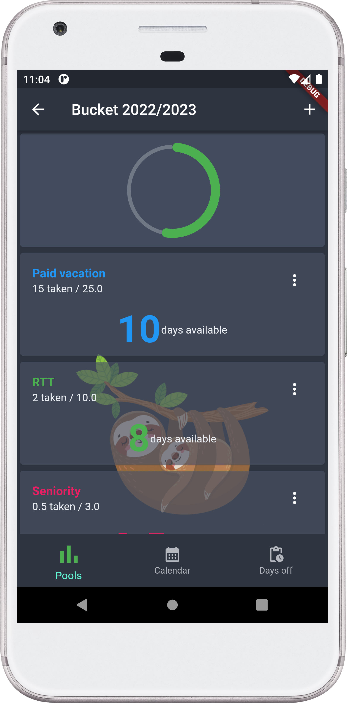
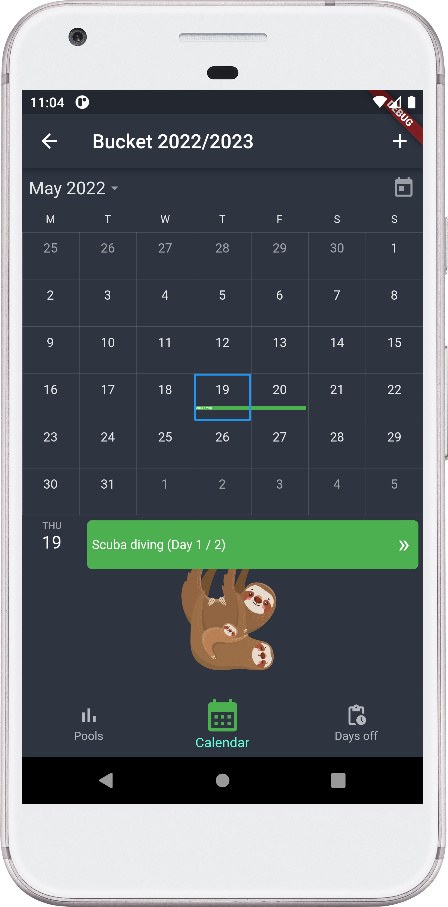
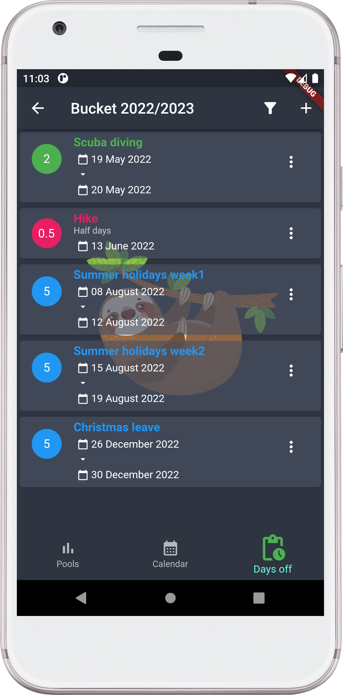

# Sloth Day

Simple day off tracker app made with Flutter.

<table>
  <tr>
    <td>Pools view</td>
     <td>Calendar view</td>
     <td>List all taken day off</td>
  </tr>
  <tr>
    <td></td>
    <td></td>
    <td></td>
  </tr>
</table>


## Database

Sloth day uses a [local database](https://pub.dev/packages/hive) saved on the phone.
At first launch, the app will ask for storage permission. If accepted the database ill be placed into the "Documents" folder of the phone so
it can be saved by any cloud app like Google Drive, Nextcloud or OneDrive.
If the permission is refused the app will be usable anyway but the database will be placed in the secured application folder which is not accessible through a file manager.

## Dev notes

Generate hive models
```
flutter packages pub run build_runner build
```
